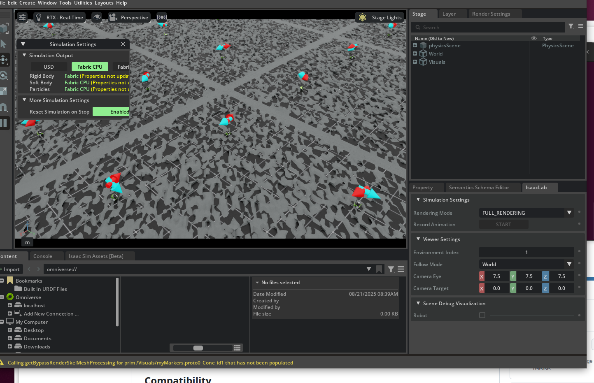

# isaac_lab_walkthrough

This Isaac Lab **Project** was generated from the template via `./isaaclab.sh --new` with the options described in the [Isaac Lab -> Walkthrough -> Isaac Lab Project Setup](https://isaac-sim.github.io/IsaacLab/main/source/setup/walkthrough/project_setup.html#isaac-lab-project-setup)

The intention is to annotate the existing [Walkthrough documentation](https://isaac-sim.github.io/IsaacLab/main/source/setup/walkthrough/index.html) while working through the tutorials.  To view the added comments, look at the git commits.

## Compatibility

The following instructions are based on using Ubuntu 22.04.  I attempted to try the same with Ubuntu 20.04 without success - although it may be possible.

## Project Setup/Install

This section covers the material in the Walkthrough sections: Isaac Lab Project Setup, Environmental Design Background and Environmental Design.

Because it was not originally obvious that it is best (or required?) to do everythying in a conda virtual environment, the [Isaac Lab Project Setup instructions](https://isaac-sim.github.io/IsaacLab/main/source/setup/walkthrough/project_setup.html) are repeated here with additional detail.

### Virtual environment - conda
Activate the base conda environment:
```
eval "$(/home/bsb/miniconda3/bin/conda shell.bash hook)" 
```

These next steps are from [Isaac Lab local installation instructions](https://isaac-sim.github.io/IsaacLab/main/source/setup/installation/pip_installation.html://isaac-sim.github.io/IsaacLab/main/source/setup/installation/pip_installation.html)
Create a new conda environment and activate
```
conda create -n env_isaaclab python=3.10
conda activate env_isaaclab
```

### Install Isaac Sim
Use `nvidia-smi` to check the host's CUDA version.  Mine was 12, so install CUDA 12 within the env_isaaclab conda environment.  Also upgrade pip and install isaacsim via pip.

Within the `env_isaaclab` conda environment...

```
pip install torch==2.5.1 torchvision==0.20.1 --index-url https://download.pytorch.org/whl/cu121
pip install --upgrade pip
pip install 'isaacsim[all,extscache]==4.5.0' --extra-index-url https://pypi.nvidia.com
```

### Install Isaac Lab

Still withint the `env_isaaclab` conda environment...

From the root of the Issac Lab local git repository 

(You may want to `git pull` to update the repo before install.)

```
./isaaclab.sh --install 
```

### Install this Project

Then install this Project.  From the root of this local git repo, still in the conda environment

```
python -m pip install -e source/isaac_lab_walkthrough
```

### Verify the Install

From the root of this local git repo, still in the conda environment

```
python scripts/list_envs.py
```

## Environment Design

The [Environment Design](https://isaac-sim.github.io/IsaacLab/main/source/setup/walkthrough/technical_env_design.html) portion of the Walkthrough requires additions and modifications of the template.  
To use the code as it is at the end of this step in the Walkthrough, checkout the `environment_design` branch.

Note that because we did not use the project name `issac_lab_tutorial`, but instead used the name `isaac_lab_walkthrough`, the names of some of the python objects and methods needed to be different than those listed in the tutorial.

You can run the vectorized training environment with the command:

```
python scripts/skrl/train.py --task=Template-Isaac-Lab-Walkthrough-Direct-v0
```

## Training the Jetbot

The [Training the Jetbot](https://isaac-sim.github.io/IsaacLab/main/source/setup/walkthrough/training_jetbot_gt.html) portion of the Walkthrough makes modifications to the environment to add visual markers as "ground truth" and to help visualize/debug the training.  

To use the code at the end of this step in the Walkthrough, checktout the `training_jetbot` branch.

You can run the vectorized training environment, with visualization markers, with the command:

```
python scripts/skrl/train.py --task=Template-Isaac-Lab-Walkthrough-Direct-v0
```

You can view the logs with something like...
```
cd ../IsaacLab
./isaaclab.sh -p -m tensorboard.main --logdir ../isaac_lab_walkthrough/logs/skrl/cartpole_direct
```

If you want to change the logging directory to something other than `cartpole_direct`, see `skrl_ppo_cfg.yaml` file.


## Exploring the RL Problem

The [Exploring the RL problem](https://isaac-sim.github.io/IsaacLab/main/source/setup/walkthrough/training_jetbot_reward_exploration.html#exploring-the-rl-problem) tutorial modifies the observations and rewards to accomplish the jetbot driving task.  

To use the code at the end of this step in the Walkthrough, checkout the `exploring` branch.

You can run the vectorized training environment, with visualization markers, with the command:

```
python scripts/skrl/train.py --task=Template-Isaac-Lab-Walkthrough-Direct-v0
```

Once training is complete, can then play the learned policy...
```
python scripts/skrl/play.py --task=Template-Isaac-Lab-Walkthrough-Direct-v0
```

## Modifying the RL Problem (Work in progress)

This goes beyond what is the existing "walkthrough" to demonstrate modifications to the configuration and learning workflow.

### Testing the environment/task

The zero agent provides no actions, but is a good way to make sure that the task is configured as desired.  Run this command to instantiate the training environment task:

```
python scripts/zero_agent.py --task=Template-Isaac-Lab-Walkthrough-Direct-v0
```

### Adding assets to the local omniverse server

This is a manual way to add the USD to the `localhost` omniverse server.  (Would be nice to do this programmatically)

If you have a USD file (often a file with a directory of of textures, materials, etc.)

* Open isaac
    ```bash
    cd ~/isaacsim
    ./isaac-sim.selector.sh
    ```

Use the content window to drag-and-drop the files into your `localhost` nucleus server.  Here is an example of what that might look like...


Note that if you hover over the file it shows the full path.  You can also right-click to copy the path and paste it into your code, "Copy URL link".

### Adding an existing USD background

The branch `add_background` illustrates adding a usd asset to the scene within the `_setup_scene` method of the environment implementation.  In the example we use the rough terrain USD included with Issac.  Large USD files can (e.g. the safety park) I don't have enough memory, even for just one environment.

We can also reduce the number of vectorized environment (default is 100) to conserve resources.

```
python scripts/zero_agent.py --num_envs=10 --task=Template-Isaac-Lab-Walkthrough-Direct-v0
```

This image shows what you should see - a few jetbots on rough ground.  (I'm not sure why the ground looks decimated.)



---

# Original README.md


# Template for Isaac Lab Projects

## Overview

This project/repository serves as a template for building projects or extensions based on Isaac Lab.
It allows you to develop in an isolated environment, outside of the core Isaac Lab repository.

**Key Features:**

- `Isolation` Work outside the core Isaac Lab repository, ensuring that your development efforts remain self-contained.
- `Flexibility` This template is set up to allow your code to be run as an extension in Omniverse.

**Keywords:** extension, template, isaaclab

## Installation

- Install Isaac Lab by following the [installation guide](https://isaac-sim.github.io/IsaacLab/main/source/setup/installation/index.html).
  We recommend using the conda installation as it simplifies calling Python scripts from the terminal.

- Clone or copy this project/repository separately from the Isaac Lab installation (i.e. outside the `IsaacLab` directory):

- Using a python interpreter that has Isaac Lab installed, install the library in editable mode using:

    ```bash
    # use 'PATH_TO_isaaclab.sh|bat -p' instead of 'python' if Isaac Lab is not installed in Python venv or conda
    python -m pip install -e source/isaac_lab_walkthrough

- Verify that the extension is correctly installed by:

    - Listing the available tasks:

        Note: It the task name changes, it may be necessary to update the search pattern `"Template-"`
        (in the `scripts/list_envs.py` file) so that it can be listed.

        ```bash
        # use 'FULL_PATH_TO_isaaclab.sh|bat -p' instead of 'python' if Isaac Lab is not installed in Python venv or conda
        python scripts/list_envs.py
        ```

    - Running a task:

        ```bash
        # use 'FULL_PATH_TO_isaaclab.sh|bat -p' instead of 'python' if Isaac Lab is not installed in Python venv or conda
        python scripts/<RL_LIBRARY>/train.py --task=<TASK_NAME>
        ```

    - Running a task with dummy agents:

        These include dummy agents that output zero or random agents. They are useful to ensure that the environments are configured correctly.

        - Zero-action agent

            ```bash
            # use 'FULL_PATH_TO_isaaclab.sh|bat -p' instead of 'python' if Isaac Lab is not installed in Python venv or conda
            python scripts/zero_agent.py --task=<TASK_NAME>
            ```
        - Random-action agent

            ```bash
            # use 'FULL_PATH_TO_isaaclab.sh|bat -p' instead of 'python' if Isaac Lab is not installed in Python venv or conda
            python scripts/random_agent.py --task=<TASK_NAME>
            ```

### Set up IDE (Optional)

To setup the IDE, please follow these instructions:

- Run VSCode Tasks, by pressing `Ctrl+Shift+P`, selecting `Tasks: Run Task` and running the `setup_python_env` in the drop down menu.
  When running this task, you will be prompted to add the absolute path to your Isaac Sim installation.

If everything executes correctly, it should create a file .python.env in the `.vscode` directory.
The file contains the python paths to all the extensions provided by Isaac Sim and Omniverse.
This helps in indexing all the python modules for intelligent suggestions while writing code.

### Setup as Omniverse Extension (Optional)

We provide an example UI extension that will load upon enabling your extension defined in `source/isaac_lab_walkthrough/isaac_lab_walkthrough/ui_extension_example.py`.

To enable your extension, follow these steps:

1. **Add the search path of this project/repository** to the extension manager:
    - Navigate to the extension manager using `Window` -> `Extensions`.
    - Click on the **Hamburger Icon**, then go to `Settings`.
    - In the `Extension Search Paths`, enter the absolute path to the `source` directory of this project/repository.
    - If not already present, in the `Extension Search Paths`, enter the path that leads to Isaac Lab's extension directory directory (`IsaacLab/source`)
    - Click on the **Hamburger Icon**, then click `Refresh`.

2. **Search and enable your extension**:
    - Find your extension under the `Third Party` category.
    - Toggle it to enable your extension.

## Code formatting

We have a pre-commit template to automatically format your code.
To install pre-commit:

```bash
pip install pre-commit
```

Then you can run pre-commit with:

```bash
pre-commit run --all-files
```

## Troubleshooting

### Pylance Missing Indexing of Extensions

In some VsCode versions, the indexing of part of the extensions is missing.
In this case, add the path to your extension in `.vscode/settings.json` under the key `"python.analysis.extraPaths"`.

```json
{
    "python.analysis.extraPaths": [
        "<path-to-ext-repo>/source/isaac_lab_walkthrough"
    ]
}
```

### Pylance Crash

If you encounter a crash in `pylance`, it is probable that too many files are indexed and you run out of memory.
A possible solution is to exclude some of omniverse packages that are not used in your project.
To do so, modify `.vscode/settings.json` and comment out packages under the key `"python.analysis.extraPaths"`
Some examples of packages that can likely be excluded are:

```json
"<path-to-isaac-sim>/extscache/omni.anim.*"         // Animation packages
"<path-to-isaac-sim>/extscache/omni.kit.*"          // Kit UI tools
"<path-to-isaac-sim>/extscache/omni.graph.*"        // Graph UI tools
"<path-to-isaac-sim>/extscache/omni.services.*"     // Services tools
...
```
